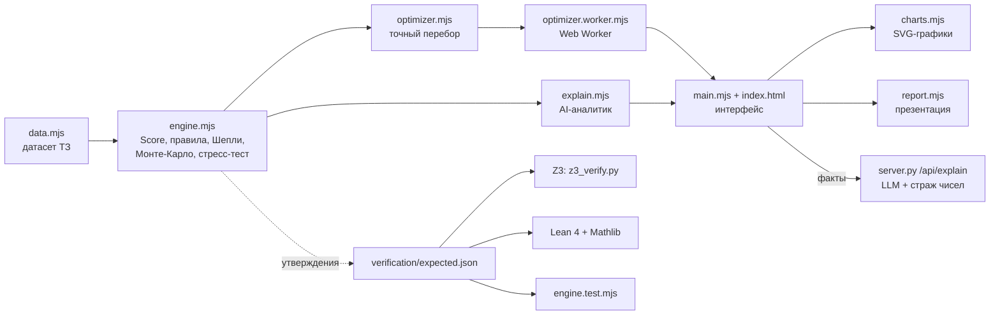

# Аким на 5 часов — AI-симулятор управления городом

Команда **BEZBAB** · HackAlem AI.

Пользователь получает единый бюджет **100 единиц**, синтетические данные по **5 районам × 10 показателям** и каталог из **14 мероприятий**. Нужно принять **ровно 5 решений**. Симулятор считает **Astana Quality of Life Score** строго по формулам задания, объясняет влияние каждой меры, находит риски и компромиссы и сравнивает сценарий со **всеми 694 395 допустимыми**. Математика модели и оптимизатора **формально проверена в Z3 и Lean 4 + Mathlib**.

## Быстрый запуск

Нужен только Python 3. Пакеты и API-ключ не требуются.

```bash
python server.py
```

Откройте <http://127.0.0.1:8000>. На Windows при необходимости запустите `py server.py`, при занятом порте — `python server.py --port 8001`. Сервер нужен, потому что браузер не загружает ES-модули по `file://`.

| Что | Как |
|---|---|
| Симулятор | <http://127.0.0.1:8000> — 5 стратегий на главной; пример из условия — в окне «Собрать свой набор» |
| Тесты в браузере (без Node.js) | <http://127.0.0.1:8000/tests.html> |
| Тесты в Node.js 20+ | `node --test` |
| Тесты сервера и стража чисел LLM | `python -m unittest test_server.py` |
| Формальная проверка Z3 | `pip install z3-solver` → `python verification/z3_verify.py --quick` (~5 мин) или без `--quick` (~25 мин) |
| Формальная проверка Lean | см. раздел «Формальная проверка» |
| LLM-объяснение (необязательно) | `pip install anthropic`, задать `ANTHROPIC_API_KEY`, перезапустить `server.py` |

## Основной сценарий

1. **Город до решений.** Формула базового Score, 5 районов, 10 показателей в каждом. Критические значения ниже 40 выделены красным.
2. **Выбор стратегии.** Оптимизатор перебирает все допустимые наборы из 5 мероприятий и предлагает **5 стратегий** с разными приоритетами:
   - «Максимальный результат» — наибольший Score;
   - «Надёжный с резервом» — почти максимум, но оставляет резерв на ликвидацию любого городского события;
   - «Поддержка отстающих» — сильнее всего поднимает самый слабый район;
   - «Улучшения для всех районов» — максимален наименьший прирост среди районов;
   - «Быстрый эффект» — только меры с запуском за 1–2 квартала.

   Стратегии отличаются друг от друга минимум двумя решениями. На каждой карточке: Score, 5 мероприятий с районами, стоимость и резерв, сколько городских событий закрыто, слабейший район «до → после», эффект за 2 года. Под карточками таблица сравнения стратегий, лучшее значение в каждой строке отмечено ★.
3. **Доработка или свой набор.** «Изменить состав» открывает конструктор с мерами выбранной стратегии, «Собрать свой набор» — пустой. Конструктор вынесен в отдельное окно: мероприятия сгруппированы по направлениям, на кнопках районов видно, как изменится Score. Недопустимые варианты заблокированы с объяснением причины. Панель показывает бюджет, резерв и прогноз Score.
4. **Результат** (после «Выбрать» или «Рассчитать сценарий») подписан названием стратегии или «Ваш набор мероприятий»:
   - Score и формула с подставленными числами: `0.7 × средняя + 0.3 × слабейший район − критические`;
   - место среди всех 694 395 допустимых наборов, устойчивость (Монте-Карло) и итог стресс-теста;
   - **AI-аналитик**: связное объяснение, сильные стороны, риски, последствия для жителей и главные компромиссы;
   - **вклад каждого решения** в Score (значение Шепли; сумма вкладов в точности равна приросту);
   - график распределения всех сценариев и граница «бюджет → максимально достижимый Score»;
   - показатели районов до и после: прирост, падения, критические значения;
   - **оптимизатор**: лучшая замена одного решения, остальные стратегии с разницей в Score и «ядро» лучших решений;
   - **стресс-тест**: 4 неожиданных городских события и перераспределение бюджета под каждое;
   - **сравнение команд**: сохранение результата, импорт сценария другой команды по коду или ссылке, таблица и попарное сравнение;
   - **презентация решения**: 5 слайдов, печать в PDF.
5. **Настройки модели** — неприметная кнопка ⚙ в правом верхнем углу (см. раздел ниже).

Интерфейс называет показатели и мероприятия словами. Коды (M1…M14, T1…C2) остаются только во внутренних данных и в ссылке на сценарий.

Сценарий кодируется в ссылку `#s=M5.saryarka_M7.nura_M8.nura_M10.nura_M12`. По ней другая команда открывает те же решения и получает тот же Score.

## Соответствие заданию

| Требование | Где реализовано |
|---|---|
| Единый бюджет и исходные данные для всех | `data.mjs`: 100 ед., датасет ТЗ. Сверка с условием — `verification/z3_verify.py` |
| 5 решений по заданным направлениям | 5 готовых стратегий по 5 мероприятий (`optimizer.mjs → STRATEGY_DEFS`) и конструктор из 14 мер; правило «ровно 5, не больше 2 из направления» (`engine.mjs → validate`) |
| Автоматический контроль бюджета | Кнопки, превышающие бюджет, заблокированы; `validate()` отклоняет набор с причиной; тест и Z3 |
| AI-анализ решений | `explain.mjs` (аналитик), `optimizer.mjs` (поиск), `engine.mjs → shapley/robustness/stressTest`, LLM в `server.py` |
| Расчёт Astana Quality of Life Score | `engine.mjs → scoreCells`, строго по формуле ТЗ; значения доказаны в Lean |
| Сильные стороны, риски, последствия | Блок «AI-аналитик» и компромиссы |
| *Опц.:* сравнение команд | Таблица сценариев, импорт по коду или ссылке, попарное сравнение |
| *Опц.:* визуализация районов | Карточки «до → после», гистограмма, граница Парето |
| *Опц.:* AI-рекомендации | 5 стратегий с таблицей сравнения, лучшая одиночная замена, ядро лучших решений |
| *Опц.:* неожиданные события и перераспределение | Страховка с пересчётом стратегий, стресс-тест, `reallocate()` с ценой перестройки, редактор событий |
| *Опц.:* автогенерация презентации | `report.mjs`: 5 слайдов и печать в PDF |
| Критерий: изменение решений меняет Score | Тест `order of decisions does not matter; changing a decision changes the Score` |

## Модель (строго по условию)

- **Показатель после мер:** `I'_dk = clip(I_dk + Σ эффект × (8 − L)/8 + синергии, 0, 100)`. Горизонт — 8 кварталов, `L` — лаг меры. Районная мера действует в выбранном районе, городская — во всех пяти.
- **Синергии** M1+M2, M10+M12, M5+M6 дают фиксированный бонус в районе первой меры пары, лагом он не масштабируется.
- **Несовместимости:** M1 и M3 — везде; M4 и M7, M5 и M13 — в одном районе.
- **Оценка района** `D_d = Σ w_k × I'_dk` с весами ТЗ (сумма 1).
- **Score** `= 0.7 × Σ pop_d × D_d + 0.3 × min D_d − N_crit`, где `N_crit` — число пар «район × показатель» строго ниже 40.
- **Контрольные значения** совпадают с условием: база **52.55768**; пример из ТЗ **56.54307** (стоимость 95, синергия M10+M12); самый дешёвый набор — **61** ед.

Все эффекты мер кратны 1/8, поэтому расчёт в `double` точен: сложение и вычитание эффектов при переборе не накапливают погрешность.

## Как устроен «AI»

Решение построено как **нейро-символическая система: числа считает проверяемая модель, язык — LLM**.

1. **Детерминированная модель** (`engine.mjs`) считает Score по формулам ТЗ, проверяет правила и выдаёт причины отказа.
2. **Аналитик** (`explain.mjs`) выводит сильные стороны, риски, последствия и компромиссы только из результата модели. Он отмечает снятые и оставшиеся критические значения, показатели «на грани» (40–43), смену слабейшего района, меры с малым вкладом, долгий лаг, побочные эффекты и непокрытые события.
3. **Оптимизатор** (`optimizer.mjs`, в Web Worker):
   - **точный перебор** всех допустимых наборов: C(14,5) наборов мер × до 5⁵ размещений ≈ 1,4 млн вариантов, из них **694 395 допустимых**, около 0,5 с;
   - перебор с отсечениями по бюджету, лимиту направления и несовместимостям; эффект меры прибавляется при входе в ветку и вычитается при выходе, без копирования массивов;
   - по итогам: распределение Score, место сценария, граница Парето «бюджет → максимум», альтернативы, ядро лучших решений, лучшая одиночная замена, перераспределение после события.
4. **Объяснимость вкладов — значения Шепли** (`engine.mjs → shapley`). Вклад каждой меры усредняется по всем порядкам добавления, поэтому сумма вкладов в точности равна приросту Score, включая синергии, штрафы и слабейший район.
5. **Неопределённость — Монте-Карло** (`robustness`). 400 прогонов с эффектами ±20% и вероятностью 25% задержки запуска на квартал. Генератор с фиксированным зерном даёт всем командам одинаковые «случайности».
6. **LLM-объяснитель** (`server.py`, необязательный). Claude (`claude-opus-5`, адаптивное мышление, серверные резервные модели при отказе) получает JSON с готовыми фактами и пишет 3 абзаца. **Страж чисел** проверяет каждое число в ответе по фактам. Если найдено число, которого нет в фактах, интерфейс показывает объяснение правил. Без ключа всё работает на правилах.

## Архитектура



| Файл | Назначение |
|---|---|
| `data.mjs` | Датасет ТЗ: районы, показатели, веса, 14 мер, синергии, конфликты; события стресс-теста |
| `engine.mjs` | Модель: применение мер, Score, валидатор, значения Шепли, устойчивость, стресс-тест, коды сценариев |
| `optimizer.mjs` / `optimizer.worker.mjs` | Точный перебор, распределение, граница Парето, альтернативы, одиночная замена, перераспределение |
| `explain.mjs` | Аналитик и пакет фактов для LLM |
| `main.mjs`, `index.html`, `styles.css`, `charts.mjs`, `report.mjs` | Интерфейс, графики, презентация |
| `model-editor.mjs` | Окно «Настройки модели»: мероприятия, веса, синергии, взаимоисключения, формула |
| `server.py` | Статический сервер без кэша, `/api/status`, `/api/explain` (LLM + страж чисел) |
| `engine.test.mjs`, `tests.html`, `tests/` | 16 тестов модели, оптимизатора, стратегий, страховки и настроек: `node --test` или в браузере |
| `test_server.py` | Тесты стража чисел и безопасного отключения LLM (без ключей и сети) |
| `verification/` | `expected.json` (утверждения), `spec.py` + `z3_verify.py` (Z3), `lean/AkimScore.lean` (Lean) |

## Формальная проверка

Утверждения JS записаны в `verification/expected.json`, и три независимых инструмента проверяют их с разных сторон.

**Z3** (`verification/z3_verify.py`). Модель заново переписана из условия задачи (`spec.py`) и закодирована как SMT-задача над точными рациональными числами. Результат: **37/37 проверок пройдено**.
- `data.mjs` совпадает с условием: 14 мер, 5 районов, веса; суммы весов и долей равны 1.
- Оценки районов совпадают с таблицей ТЗ, база — ровно 52.55768.
- Пример, самый дешёвый набор и оптимум допустимы, а их Score совпадает в точном расчёте Python, в SMT-модели и в JS.
- Минимальная стоимость — 61 (Z3 minimize).
- **Глобальный оптимум 57.236735 доказан**: Z3 возвращает `unsat` на запрос «существует набор со Score больше».
- Каждая из 11 точек границы Парето оптимальна, и между точками улучшений нет.
- Независимый перебор в Python даёт те же 694 395 допустимых наборов.

**Lean 4 + Mathlib** (`verification/lean/AkimScore.lean`, все доказательства без `sorry`):
- нормировка весов и долей;
- базовый Score, Score примера и Score оптимума — точные равенства в `ℚ`, проверенные ядром Lean (`decide +kernel`, не `native_decide`);
- пример и оптимум удовлетворяют всем правилам;
- `districtScore ∈ [0, 100]`, `score ≤ 100`;
- **монотонность:** улучшение любых показателей никогда не снижает Score, то есть у формулы нет «вредных» улучшений;
- **эффективность вкладов:** телескопирование маргинальных вкладов и равенство среднего по всем `n!` порядкам полному приросту Score (свойство значения Шепли).

Запуск Lean. Нужен elan; при первой сборке `lake exe cache get` скачивает готовый Mathlib, несколько ГБ.

```bash
cd verification/lean
lake exe cache get
lake env lean AkimScore.lean
```

## Что показывают данные

- Разброс Score среди допустимых наборов — **52.04–57.24**, база — 52.56. Ошибочный выбор может ухудшить город, а не только недоулучшить.
- **Максимум — 57.24** за 98 ед.: M2 и M14 по городу, ЛРТ M3, поликлиника M8 и спорт-хабы M9 в Нуре.
- **Экономный вариант — 57.09 за 86 ед.** Он уступает всего 0.15 п., зато оставляет 14 ед. резерва и **покрывает все 4 события** стресс-теста.
- Пример из ТЗ (56.54) занимает **566-е место из 694 395**, это топ-0,08%.
- **Поликлиника M8 в Нуре входит в 100%** из 2000 лучших наборов: в модели это самое надёжное решение.

## Настройки модели

Кнопка **⚙** в правом верхнем углу открывает окно, в котором можно менять модель:

- **Мероприятия** — таблица всех мер: название, направление, тип (район или город), стоимость, лаг и эффекты на каждый из 10 показателей. Можно править существующие меры, удалять их и добавлять новые (ID присваивается автоматически: M15, M16…).
- **Веса показателей** — вклад каждого показателя в оценку района; кнопка «Нормировать к 1» возвращает сумму весов к 1.
- **Синергии** — пары мер, бонус к показателю и пояснение. Бонус начисляется в районе первой районной меры пары, а если обе меры городские — во всех районах.
- **Взаимоисключения** — пары мер, которые нельзя выбрать вместе либо вообще («везде»), либо в одном районе.
- **Для опытных: формула итоговой оценки** — свёрнутый блок внизу окна. В нём можно поменять веса «средняя по жителям / слабейший район», порог и штраф критических значений и включить **штраф за отставание районов**:
  `Score = a × D_ср + b × min D − p × N(показатель < t) − λ × Σ max(0, T − D_d)`.
  При λ = 0 это формула ТЗ. Чем больше λ, тем сильнее каждый район с оценкой ниже T тянет итог вниз.

Правки попадают в черновик и применяются кнопкой «Применить», только если проверка не нашла ошибок. Ошибки — например, повторяющийся ID, отрицательный вес или взаимоисключение меры с самой собой — блокируют применение. Предупреждения, например сумма весов ≠ 1, не блокируют. После применения пересчитываются базовый Score, каталог, анализ и полный перебор (в Web Worker). Модель сохраняется в браузере.

Пока модель отличается от ТЗ, вверху страницы висит плашка «Модель изменена» с кнопкой «Вернуть модель ТЗ». Упоминания Z3 и Lean в интерфейсе появляются только для модели ТЗ: формальная проверка относится именно к ней. По условию задачи все команды считают на одной модели, поэтому для защиты используйте модель ТЗ.

## Городские события и страховка

Опциональный пункт задачи — «неожиданные городские события, требующие перераспределения бюджета». События — синтетическое расширение (`EVENTS` в `data.mjs`), **на официальный Score не влияют** и одинаковы для всех команд.

У события есть район, удар по показателям, стоимость ликвидации и профильные меры. Если в наборе есть профильная мера (в районе события или городская), **ликвидация дешевле** (по умолчанию на 50%) и **удар слабее** (на 50%). Например, «Авария на теплотрассе» в Алматы стоит 12 ед., а с «Аварийными бригадами ЖКХ» — 6.

- **Страховка (до решения).** Над стратегиями — переключатели по событиям и режим «одно событие за 2 года» (резерв = самая дорогая ликвидация) или «все отмеченные сразу» (резерв = сумма). Резерв считается **для каждого из 694 395 наборов отдельно** с учётом профильных мер, и 5 стратегий подбираются заново с условием «стоимость мер + нужный резерв ≤ 100». Оптимизатор сам решает, выгоднее заложить больший резерв или взять меру, которая удешевит ликвидацию: при страховке от аварии «Максимальный результат» берёт аварийные бригады, резерв падает с 12 до 6 ед., Score — 57.23 вместо 57.24. Совет «один шаг» страховку не ломает, конструктор показывает, хватает ли резерва.
- **Стресс-тест (после решения).** Для выбранного набора каждое событие проверяется отдельно: хватает ли резерва на ликвидацию (с учётом удешевления) или сколько баллов теряется. «Перераспределить» перебирает все наборы, на которые хватит денег вместе с ликвидацией, и показывает цену перестройки: 1, 2, … изменения.
- **Редактор событий** — вкладка «События» в настройках модели: район, удар по каждому показателю, стоимость ликвидации, до двух профильных мер, проценты удешевления и смягчения; события можно добавлять и удалять. Изменения событий не меняют официальный Score, поэтому модель остаётся «моделью ТЗ».

## Ограничения и развитие

- Данные и эффекты синтетические. Для реального города нужны открытые данные, калибровка эффектов и экспертная проверка причинных связей.
- Сценарии команд хранятся в `localStorage` и передаются кодом или ссылкой. Для общего рейтинга на площадке нужен серверный список.
- Точный перебор масштабируется до десятков мер. Для большего каталога та же SMT-кодировка из `z3_verify.py` работает как точный оптимизатор без полного перебора.
- LLM-объяснение требует ключа Anthropic. Ключ хранится только в переменной окружения сервера и никогда не попадает в браузер.
